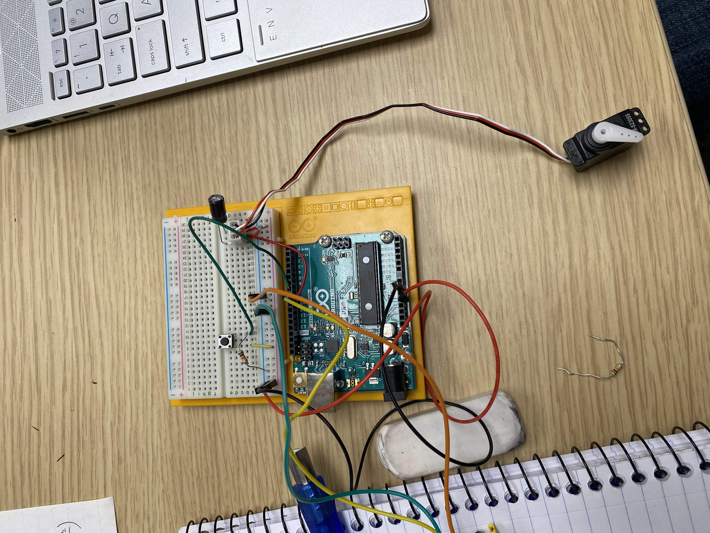
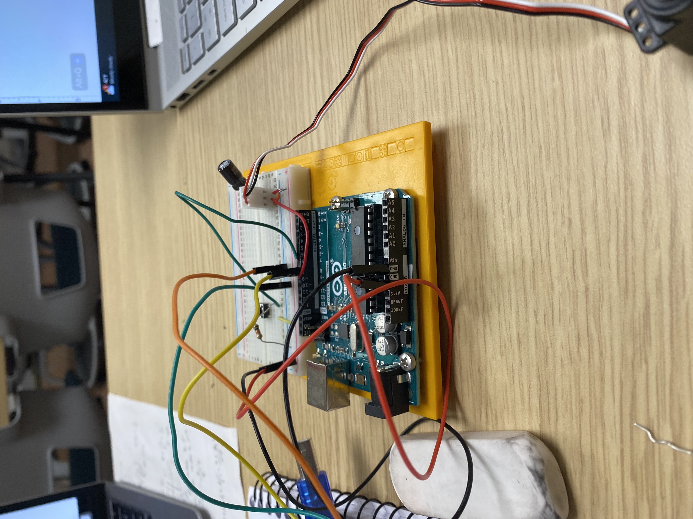

## SSE Handwaving Bot

This little creature waves at passerbys. It is triggered either by a motion detector, or a button. 

The motion detector is a HiLetgo HC-SR501 PIR Infared IR Sensor.

## Circuit:

